<!-- ============================================================
     README.md
     Laboratorio de Validaciones, Métodos Estáticos y Nuevos Controles
     Victor Montes — UTP
     ============================================================ -->

<p align="center">
  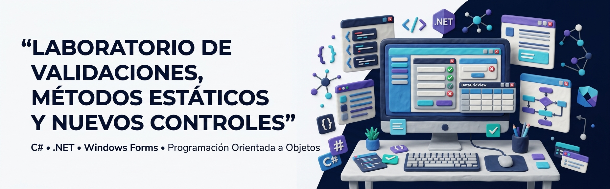
</p>

<h1 align="center">Laboratorio #3 — Validaciones, Métodos Estáticos y Nuevos Controles</h1>

<p align="center">
  <strong>Programación en C# · Windows Forms · Validaciones · Métodos Estáticos · Controles de Interfaz</strong>
</p>

<p align="center">
  
  
  
  
  
</p>

<p align="center">
  <a href="#contenido-del-repositorio">Contenido</a> •
  <a href="#objetivos">Objetivos</a> •
  <a href="#tecnologías-utilizadas">Tecnologías</a> •
  <a href="#ejercicios">Ejercicios</a> •
  <a href="#capturas-de-pantalla">Capturas</a> •
  <a href="#estructura-del-repositorio">Estructura</a> •
  <a href="#ejecución-y-uso">Ejecución</a>
</p>

---

## Información del laboratorio

| Campo                    | Información                                                                   |
| ------------------------ | ----------------------------------------------------------------------------- |
| **Laboratorio**          | #3                                                                            |
| **Fecha**                | 13/09/2026                                                                    |
| **Estudiante**           | Victor Montes                                                                 |
| **Institución**          | Universidad Tecnológica de Panamá                                             |
| **Lenguaje principal**   | C#                                                                            |
| **IDE**                  | Visual Studio                                                                 |
| **Tipo de aplicaciones** | Windows Forms y Consola                                                       |
| **Repositorio**          | `Laboratorio-Validaciones-Métodos-Estáticos-y-Nuevos-Controles-Victor-Montes` |

---

## Contenido del Repositorio

Este repositorio contiene los ejercicios desarrollados para el laboratorio de **Validaciones, Métodos Estáticos y Nuevos Controles**, utilizando el lenguaje **C#**.

La práctica reúne tres aplicaciones independientes que permiten trabajar diferentes conceptos de programación y desarrollo de interfaces:

| Ejercicio     | Aplicación    | Conceptos principales                                                       |
| ------------- | ------------- | --------------------------------------------------------------------------- |
| **Código #1** | Windows Forms | Validaciones, controles, `ErrorProvider`, `DataGridView`, métodos estáticos |
| **Código #2** | Consola       | Juego Craps, `Random`, enumeraciones, estructuras de control                |
| **Código #3** | Windows Forms | Formularios MDI, navegación entre ventanas y controles                      |

---

## Objetivos

### Objetivo general

Aplicar diferentes mecanismos de validación y controles de interfaz en aplicaciones desarrolladas con C#, reforzando el uso de métodos estáticos, formularios Windows Forms, estructuras de control y componentes de interacción con el usuario.

### Objetivos específicos

* Implementar validaciones de datos introducidos por el usuario.
* Utilizar `ErrorProvider` para mostrar errores en controles.
* Crear métodos estáticos reutilizables para tareas de validación.
* Trabajar con objetos y colecciones en C#.
* Mostrar información mediante `DataGridView`.
* Implementar lógica condicional y estructuras repetitivas.
* Utilizar enumeraciones para representar estados.
* Generar números aleatorios mediante `Random`.
* Crear aplicaciones Windows Forms con múltiples formularios.
* Utilizar formularios MDI para organizar ventanas secundarias.

---

# Tecnologías Utilizadas

<p align="center">
  
</p>

### Lenguaje

| Tecnología                                                                | Uso                                |
| ------------------------------------------------------------------------- | ---------------------------------- |
|  **C#**   | Desarrollo de todos los ejercicios |
|  **.NET** | Plataforma de ejecución            |
| **.NET Framework 4.7.2**                                                  | Código #1 y Código #3              |
| **.NET 10**                                                               | Código #2                          |

### Herramientas

| Herramienta                                                                              | Utilización                                 |
| ---------------------------------------------------------------------------------------- | ------------------------------------------- |
|  **Visual Studio** | Desarrollo, compilación y ejecución         |
|  **Git**                    | Control de versiones                        |
|  **GitHub**              | Almacenamiento y documentación del proyecto |

### Componentes y conceptos

```text
C#
│
├── Windows Forms
│   ├── Form
│   ├── TextBox
│   ├── DataGridView
│   ├── ErrorProvider
│   ├── ToolStrip
│   └── MDI Forms
│
├── Programación
│   ├── Clases
│   ├── Objetos
│   ├── Métodos
│   ├── Métodos estáticos
│   ├── Enumeraciones
│   ├── Colecciones
│   └── Validaciones
│
└── Estructuras de control
    ├── if / else
    ├── switch
    ├── while
    └── return
```

---

# Flujo General del Laboratorio

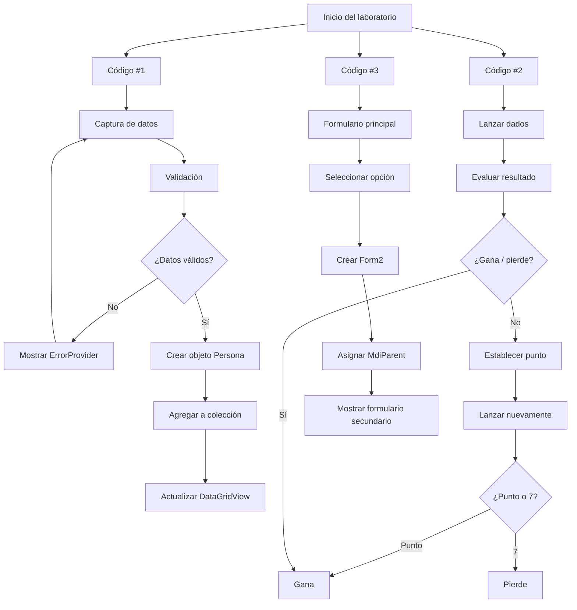

---

# Ejercicios

## Código #1 — Validaciones y métodos estáticos

### Descripción

El primer ejercicio consiste en una aplicación de escritorio desarrollada con **Windows Forms** para registrar información de colaboradores.

La aplicación permite introducir datos como:

* ID del empleado
* Nombres
* Apellidos
* Correo electrónico
* Salario
* Fecha de nacimiento

Antes de registrar un colaborador, la aplicación verifica que los datos introducidos cumplan las condiciones establecidas.

### Funcionalidades principales

| Funcionalidad             | Implementación                    |
| ------------------------- | --------------------------------- |
| Registro de colaboradores | Clase `Persona`                   |
| Validación de ID          | Comprobación de campo obligatorio |
| Validación de nombres     | Comprobación de campo obligatorio |
| Validación de apellidos   | Comprobación de campo obligatorio |
| Validación de correo      | Método estático                   |
| Validación de salario     | `decimal.TryParse()`              |
| Mensajes de error         | `ErrorProvider`                   |
| Visualización             | `DataGridView`                    |
| Limpieza de formulario    | Botón de limpieza                 |

La lógica principal realiza las validaciones antes de crear y agregar el objeto `Persona` a la colección.

### Método estático de validación

La clase `Utilidades` contiene métodos reutilizables para determinar si un texto está vacío y validar una dirección de correo electrónico mediante una expresión regular.

```text
Usuario introduce datos
        │
        ▼
┌─────────────────────┐
│ Validar ID          │
└─────────┬───────────┘
          ▼
┌─────────────────────┐
│ Validar nombres     │
└─────────┬───────────┘
          ▼
┌─────────────────────┐
│ Validar apellidos   │
└─────────┬───────────┘
          ▼
┌─────────────────────┐
│ Validar correo      │
└─────────┬───────────┘
          ▼
┌─────────────────────┐
│ Validar salario     │
└─────────┬───────────┘
          ▼
     ¿Todo correcto?
       /       \
     NO         SÍ
     │           │
     ▼           ▼
 ErrorProvider  Crear Persona
                 │
                 ▼
          Agregar a lista
                 │
                 ▼
          Actualizar tabla
```

### Capturas de pantalla

#### Interfaz principal

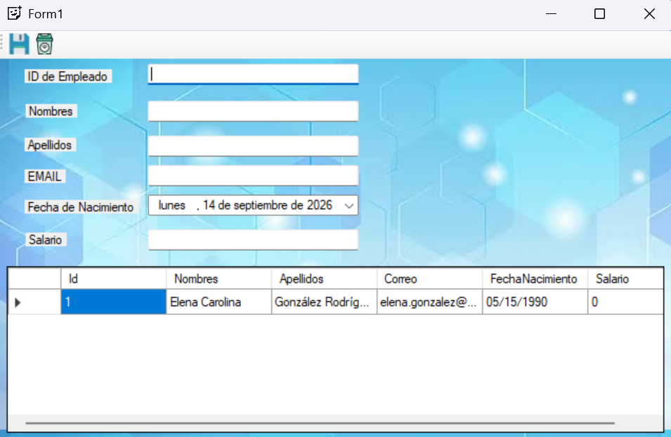

#### Validación de nombres

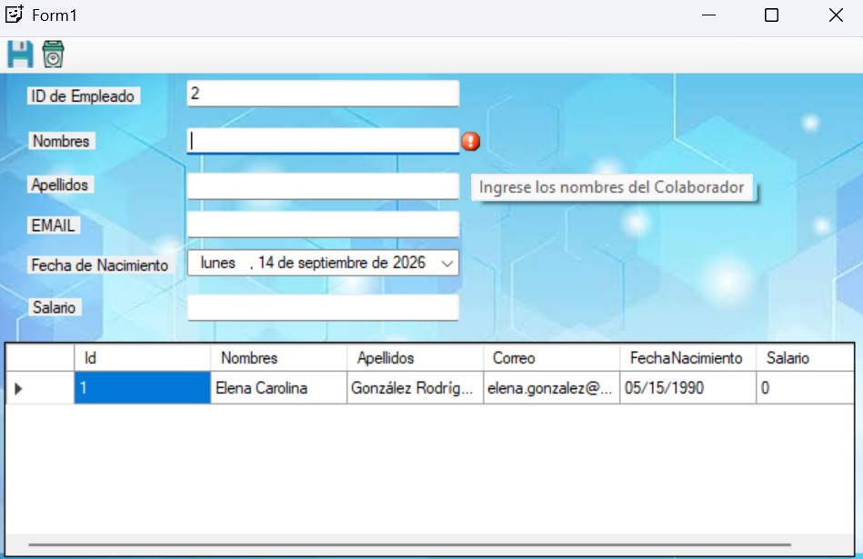

#### Validación de ID

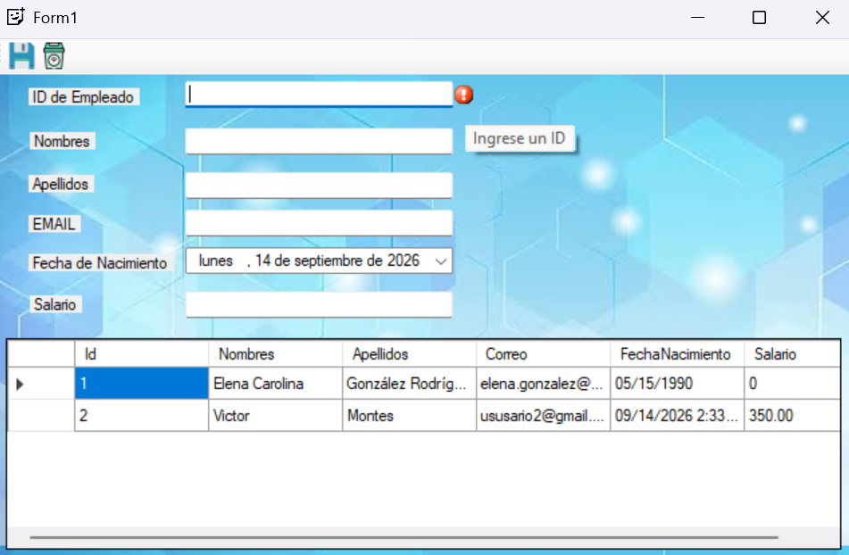

#### Validación de correo electrónico

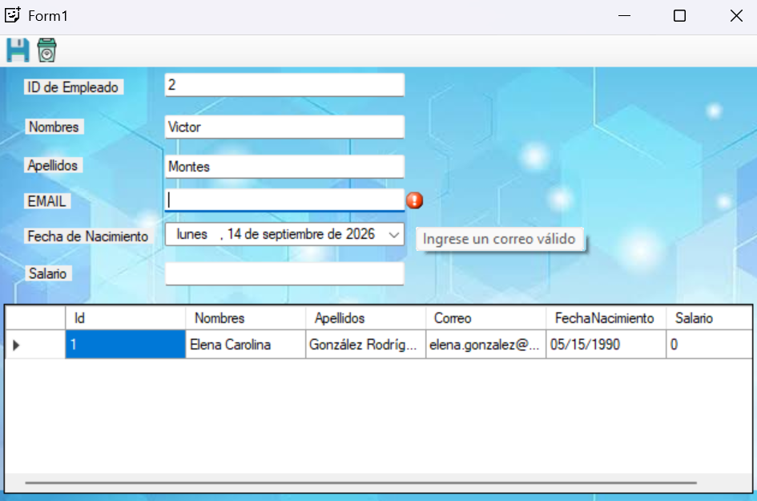

#### Validación de salario

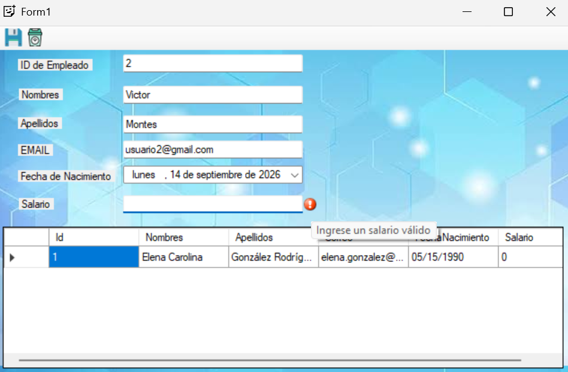

#### Registro exitoso

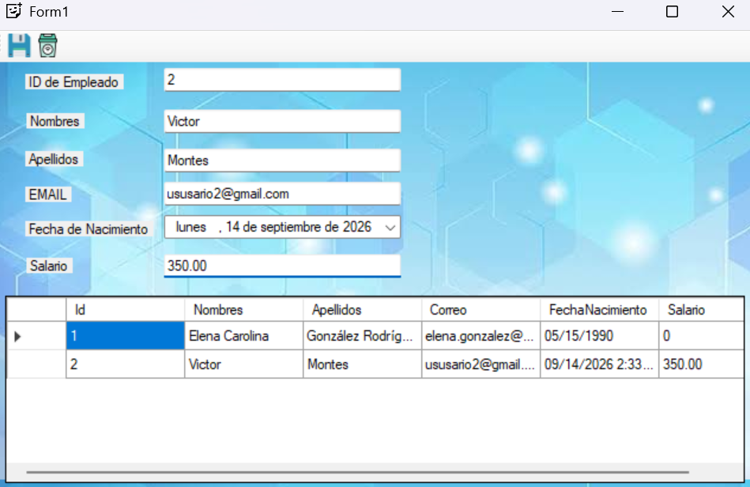

---

## Código #2 — Juego Craps

### Descripción

El segundo ejercicio implementa el juego de dados **Craps** como una aplicación de consola.

La aplicación utiliza números aleatorios para generar los resultados de dos dados y determina el estado del juego de acuerdo con las reglas implementadas.

El proyecto está configurado como una aplicación de consola para **.NET 10**.

### Elementos utilizados

* Clase `Craps`
* Clase `Random`
* Enumeración `NombreDados`
* Enumeración `Estado`
* Método `Jugar()`
* Método `LanzarDados()`
* `switch`
* `while`
* Condicionales `if / else`

El código define estados `CONTINUA`, `GANA` y `PIERDE`, además de valores específicos para las sumas relevantes de los dados.

### Flujo del juego

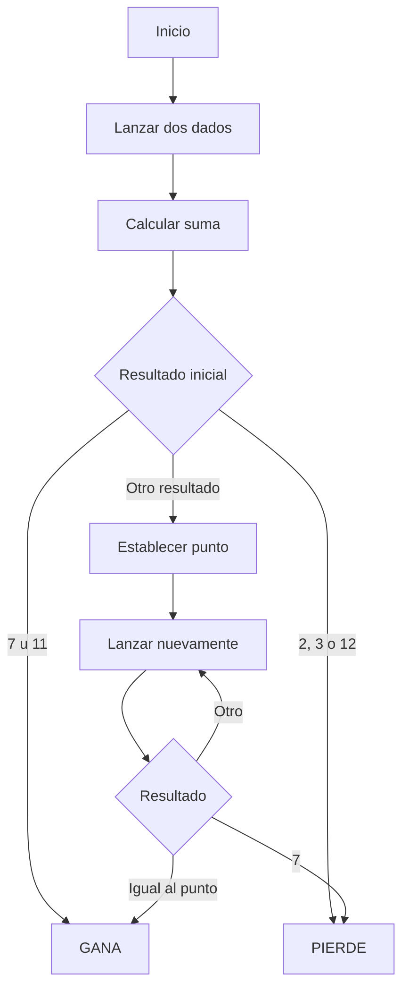

### Captura de ejecución

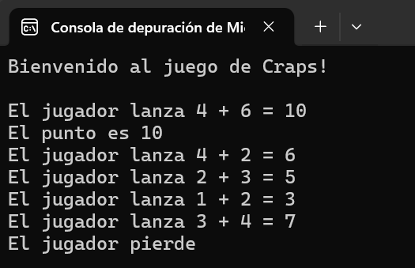

---

## Código #3 — Formularios MDI y nuevos controles

### Descripción

El tercer ejercicio corresponde a una aplicación **Windows Forms** compuesta por un formulario principal y un formulario secundario.

El formulario principal crea una instancia de `Form2`, establece el formulario principal como su `MdiParent` y posteriormente muestra el formulario secundario.

### Componentes principales

| Componente  | Función                                     |
| ----------- | ------------------------------------------- |
| `Form1`     | Ventana principal                           |
| `Form2`     | Ventana secundaria                          |
| `MdiParent` | Establece la relación entre formularios     |
| `Show()`    | Muestra el formulario secundario            |
| `ToolStrip` | Contiene la acción para abrir el formulario |

### Flujo

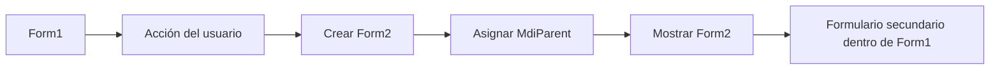

### Capturas de pantalla

#### Interfaz principal

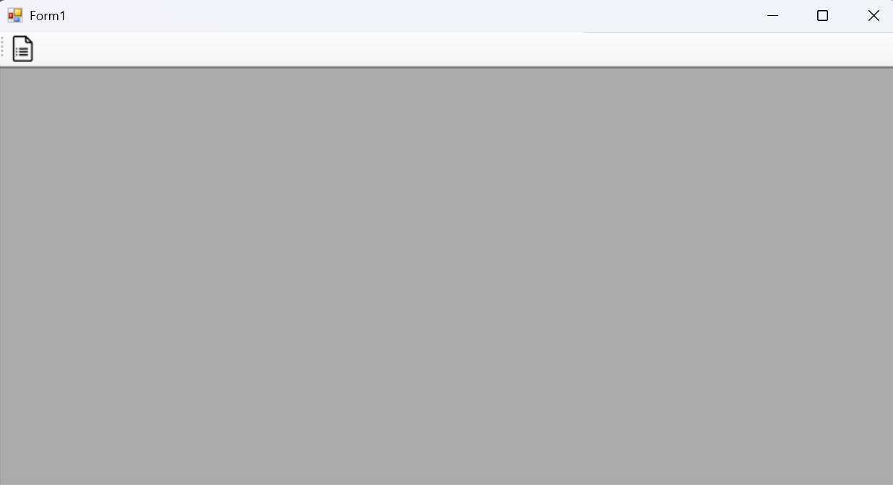

#### Formulario secundario

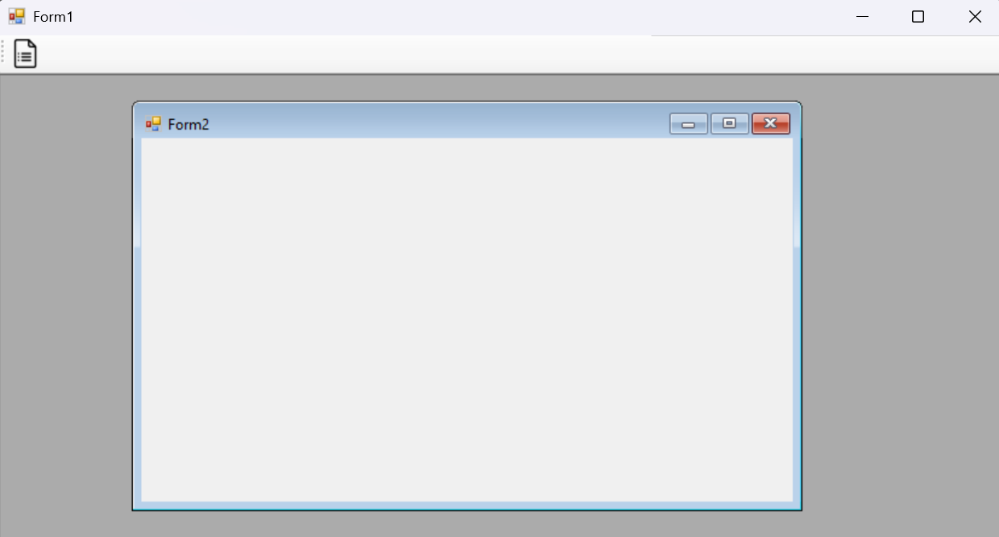

---

# Capturas de Pantalla

Esta sección reúne las evidencias visuales de la ejecución de cada ejercicio.

| Ejercicio | Evidencia                                       |
| --------- | ----------------------------------------------- |
| Código #1 | Registro, validaciones y tabla de colaboradores |
| Código #2 | Ejecución del juego Craps                       |
| Código #3 | Formulario principal y formulario secundario    |

Las imágenes utilizadas para documentar los ejercicios se encuentran organizadas dentro de la carpeta `assets`.

---

# Estructura del Repositorio

```text
Laboratorio-Validaciones-Metodos-Estáticos-y-Nuevos-Controles-Victor-Montes/
│
├── CODIGO #1 - Victor Montes/
│   ├── .vs/
│   └── CODIGO #1/
│       ├── Form1.cs
│       ├── Form1.Designer.cs
│       ├── Form1.resx
│       ├── Persona.cs
│       ├── Program.cs
│       ├── Utilidades.cs
│       ├── App.config
│       └── CODIGO #1.csproj
│
├── CODIGO #2 - Victor Montes/
│   ├── .vs/
│   └── Codigo #2 - Victor Montes/
│       ├── Craps.cs
│       ├── Program.cs
│       └── Codigo #2 - Victor Montes.csproj
│
├── CODIGO #3 - Victor Montes/
│   ├── .vs/
│   └── CODIGO #3 - Victor Montes/
│       ├── Form1.cs
│       ├── Form1.Designer.cs
│       ├── Form1.resx
│       ├── Form2.cs
│       ├── Form2.Designer.cs
│       ├── Form2.resx
│       ├── Program.cs
│       └── CODIGO #3 - Victor Montes.csproj
│
├── assets/
│   ├── banner-laboratorio.jpg
│   │
│   ├── codigo1/
│   │   ├── interfaz-principal.png
│   │   ├── registro-exitoso.png
│   │   ├── validacion-correo.png
│   │   ├── validacion-id.png
│   │   ├── validacion-nombres.png
│   │   └── validacion-salario.png
│   │
│   ├── codigo2/
│   │   └── ejecucion-craps.png
│   │
│   └── codigo3/
│       ├── interfaz-principal.png
│       └── formulario-secundario.png
│
└── README.md
```

> **Nota:** El repositorio también contiene archivos generados por Visual Studio, como carpetas `.vs`, `bin` y `obj`, correspondientes al entorno de desarrollo y compilación.

---

# Ejecución y Uso

## Requisitos

Antes de ejecutar los ejercicios se recomienda contar con:

* Windows.
* Visual Studio.
* C#.
* .NET Framework 4.7.2 para los proyectos Windows Forms.
* .NET 10 SDK para el proyecto de consola.
* Git, si se desea clonar el repositorio.

---

## Clonar el repositorio

```bash
git clone https://github.com/VITIDEV06/Laboratorio-Validaciones-M-todos-Est-ticos-y-Nuevos-Controles-Victor-Montes.git
```

Después:

```bash
cd Laboratorio-Validaciones-M-todos-Est-ticos-y-Nuevos-Controles-Victor-Montes
```

---

## Ejecutar Código #1

Abrir la solución:

```text
CODIGO #1 - Victor Montes/CODIGO #1.slnx
```

Desde Visual Studio:

```text
1. Abrir la solución.
2. Seleccionar el proyecto "CODIGO #1".
3. Compilar el proyecto.
4. Ejecutar con F5 o Ctrl + F5.
5. Probar las diferentes validaciones.
```

---

## Ejecutar Código #2

Ubicarse en:

```text
CODIGO #2 - Victor Montes/Codigo #2 - Victor Montes/
```

Ejecutar:

```bash
dotnet run
```

El programa inicia el juego Craps y muestra en consola los lanzamientos y el resultado correspondiente.

---

## Ejecutar Código #3

Abrir:

```text
CODIGO #3 - Victor Montes/CODIGO #3 - Victor Montes.slnx
```

Desde Visual Studio:

```text
1. Abrir la solución.
2. Seleccionar el proyecto "CODIGO #3 - Victor Montes".
3. Compilar.
4. Ejecutar con F5 o Ctrl + F5.
5. Utilizar la opción disponible en el formulario principal.
6. Observar la apertura del formulario secundario.
```

---

# Conceptos Aplicados

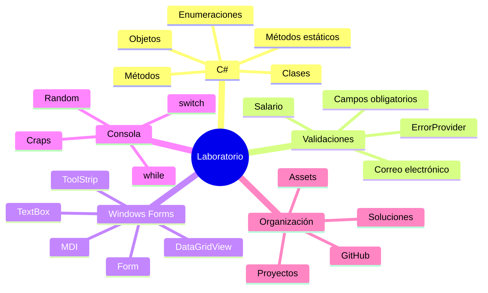

---

# Resultados

Con el desarrollo de los tres ejercicios se aplicaron diferentes conceptos de programación en C#, desde validaciones de información y reutilización de métodos hasta estructuras de control, generación de valores aleatorios y organización de formularios Windows Forms.

El laboratorio permite observar cómo diferentes componentes del lenguaje pueden combinarse para desarrollar aplicaciones funcionales tanto de escritorio como de consola.

---

# Autor y Contexto

<table>
<tr>
<td>

### Victor Montes

**Universidad Tecnológica de Panamá (UTP)**
Facultad de Ingeniería de Sistemas Computacionales

</td>
</tr>
</table>

| Información              | Detalle                              |
| ------------------------ | ------------------------------------ |
| **Nombre**               | Victor Montes                        |
| **Institución**          | Universidad Tecnológica de Panamá    |
| **Área**                 | Ingeniería de Sistemas y Computación |
| **Lenguaje**             | C#                                   |
| **Repositorio**          | GitHub                               |
| **Fecha de realización** | 13/09/2026                           |

<p align="center">
  
</p>

---

# Referencias

* Documentación oficial de C# y .NET.
* Documentación de Windows Forms.
* Documentación de Visual Studio.
* Material proporcionado para el laboratorio.
* Video de apoyo proporcionado para la práctica.
* **Win32OpenSSL**, utilizado como referencia indicada en las instrucciones del laboratorio.

### Recursos

<p align="center">
  <a href="https://learn.microsoft.com/dotnet/csharp/">
    
  </a>
  <a href="https://learn.microsoft.com/dotnet/desktop/winforms/">
    
  </a>
  <a href="https://learn.microsoft.com/visualstudio/">
    
  </a>
</p>

---

<p align="center">
  <strong>Laboratorio de Programación en C#</strong>
  <br>
  Universidad Tecnológica de Panamá
  <br><br>
  <sub>Documentación desarrollada por Victor Montes</sub>
</p>
